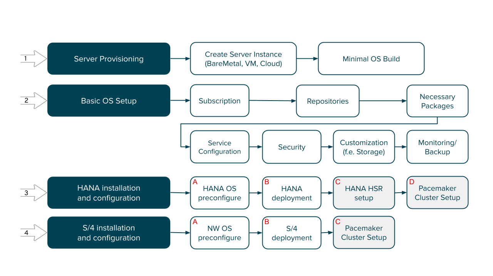
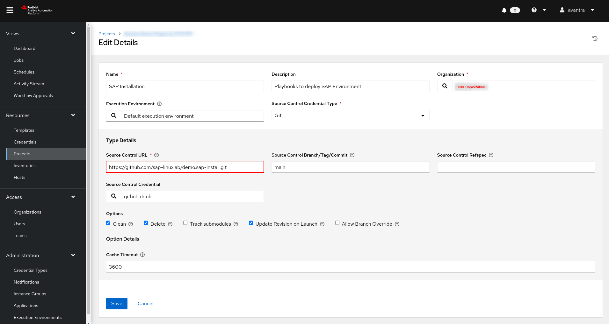

# demo.sap-install - PowerVC Branch


CAUTION: **Currently this is an usuable copy of the google branch**

This repository contains the demo for deploying on IBM PowerVC with ansible the community.sap_install collection
and how to use this from [AWX](https://github.com/ansible/awx) or [Red Hat Ansible Controller](https://www.ansible.com/products/controller?hsLang=en-us)

## Demo Description

This demo deploys HANA and S/4 servers on a google cloud following this process:
 

You will find the corresponding playbooks here which implement the steps of the above workflow

### Demo setup

Switch to main branch to read how to deploy Ansible Automation platform on an INtel based server or virtual machine.

To use this demo you need to have the following information available:

- Admin Access to your Ansible Automation or AWX Controller
- Name or IP Adress of PowerVC
- Access Credentials for PowerVC (to create LPARs and Network)
- A preconfigured RHEL Image that can be deployed using PowerVC
- Network Ports of PowerVC need to be reachable by Ansible Execution Environment

**Openstack Ports used by PowerVC**

| Port | OpenStack Component Name |
|------|--------------------------|
| 5000 | Keystone                 |
| 8774 | Nova                     |
| 9696 | Neutron                  |
| 9000 | Cinder                   |
| 9292 | Glance                   |

#### Follow these configuration steps

1. Configure PowerVC
2. Configure AAP/AWX to interact with PowerVC
3. Configure AAP/AWX for SAP HANA Deployment
4. Configure AAP/AWX for SAP S/4HANA Deployment

l
#### Configure this project in AAP/AWX Controller

1. Login to your AAP/AWX Controller as admin
2. Click `Resources -> Projects`
3. Click `Add`
4. Enter the following parameters:
   - Name: `SAP Install Demo PowerVC`
   - select Organization
   - select Source Control Type `Git`
   - Enter Source Url: `https://github.com/sap-linuxlab/demo.sap-install.git`
   - Enter branch `powervc`
   - Select options as needed
   
5. Click `Save`

#### Configure AAP/AWX Credentials fro Power VC

1. Login to your AAP/AWX Controller as admin
2. Click `Resources -> Credentials`
3. Click `Add`
4. Enter the following parameters
   - name: `PowerVC Credential`
   - organization `Default`
   - select Credential Type `OpenStack`
   - Username with permissions to create LPARs etc. in PowerVC
   - Password for this user
   - host authentication URL (e.g. https://my-powervc:5000/v3)
   - Project (Tenant Name)
   - Project Domain Name: `Default`
   - Domain Name: `Default`
   - De-select Verify SSL, if you use self-signed certificates in PowerVC
   
   You get this infomation by logging into PowerVC and by clicking on the user logo in the top right of PowerVC:<BR><br>
   
5. Click Save

| :exclamation:  Please Note              |
|:----------------------------------------|

> In the AAP/AWX credentials you can only define the previous parameters for authentication.
> Define the following dictionary in addition to  the OpenStack credential in case you need additional parameters, e.g. `user_domain_name` for authentication:
> <pre>
>     os_add_auth:
>       auth_url: https://powervc:5000/v3/ # mandatory to repeat
>       user_domain_name: Default          # additional parameters for auth section
> </pre>


#### Test the connection by listing disk images from PowerVC

1. Login to your AAP/AWX Controller as admin
2. Click `Resources -> Templates`
3. Click `Add -> Add Job Template`
4. Enter the following parameters
   - Name: e.g `tool - list disk images`
   - Job Type: `Run`
   - Inventory: An inventory that contains localhost
   - Project: `SAP Install Demo PowerVC`
   - select Playbook: `tools/power_list_diskimages.yml`
   - select Credential `Power VC Credential` from category `OpenStack`
5. OPTIONAL: if you need `user_domain_name` for authentication add the following to the Variables section (or define an additional custom credential in AAP/AWX Controller):
    <pre>
      os_add_auth:
        auth_url: https://powervc:5000/v3/
        user_domain_name: Default
    </pre>  
6. Click `Save`
7. Click `Launch`


| :exclamation:  Please Note              |
|:----------------------------------------|

> If everything goes well, you can continue with the next steps.
> If the template fails, you probably have the wrong parameters or you might need to add additional paramters such as `user_domain_name`.

#### Required Variables for Inventory


<pre>
power_machines:
   - vm_create_name: _hostname_
   - vm_create_create_ip: _try without for variable IP
   - vm_create_flavor: OpenStack VM Flavor
   - vm_group_name:
   - vm_create_deploy_target:
</pre>

To see what flavors are available, log in to PowerVC console and click -> VirtualMachines -> Compute Templates
#### Global Variables
<pre>
- os_add_auth: ...

- os_image_filter: _start of image name, e.g rhel86  (os_image_name -> internal use)
- os_availability_zones[os_deploy_target]
- os_network
</pre>

##### Availability Zones

availabiltiy zones are optional to create in PowerVC. In case you want use ability zones configure them in PowerVC and create an array with your availability zones.

**Example Definition**

```yaml
os_availability_zones:
  "AllServers": "AllServers"
  SERVER1: ":900922A_78AD123"
  SERVER2: ":922322H_78C1234"
  SERVER3: ":922322H_78C2345"
```

To deploy a server in an availability zone and the following line to your creation dictionary:
```yaml
- vm_create_deploy_target: SERVER1
```

  openstack.cloud.networks_info:
    auth:
      auth_url: https://identity.example.com
      username: user
      password: password
      project_name: someproject
  register: result

availability_zones:


#### Configure
#### Helpful Tools (playbooks)

### Run the Demo

Login to Controller with your admin credentials


## Additional Documentation

- [Automating PowerVC using Ansible](https://developer.ibm.com/tutorials/automating-powervc-using-ansible/)
- [AWX Project Google Group](https://groups.google.com/g/awx-project)
- [AWX Project FAQ](https://www.ansible.com/products/awx-project/faq)
