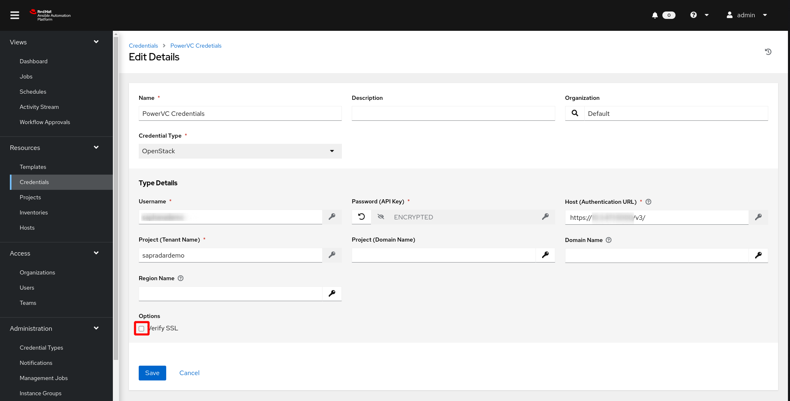
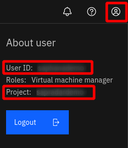

# Credentials

In Automation Controller/AWX credentials are stored encrypted.
In addition to the standard credential types, the following custom credential types may be needed:

 - Credentials to register Red Hat subscriptions with an activation key
 - Credentials to download SAP software

## Configure Custom Credential Types

Go to `Administration` -> `Credential Types`

### Credentials to Register Systems to RHN with an Activation Key

The variables defined here are used in the role `mk_ansible_roles.subscribe_rhn`. You may use other ways to subscribe your RHEL system, then you don't need this.

1. Click `Add`
2. Enter the following:
    - **Name**: SAP S-User
    - **Input Configuration**:

      ```yaml
      fields:
        - id: activationkey
          type: string
          label: Activation Key
          secret: true
        - id: orgid
          type: string
          label: Organization ID
          secret: true
      required:
        - activationkey
        - orgid
      ```
    - **Injector Creation**:
      ```yaml
      ---
      extra_vars:
        reg_activation_key: '{{ activationkey }}'
        reg_organization_id: '{{ orgid }}'
      ```
3. Click `Save`

This creates a Form for injecting the two variable `reg_activation_key` and `reg_organization_id` to a job template (available to the playbook).
If you want to use username, password and pool id for registration, you can do so. Just create a similar template, injecting the variables `reg_username`, `reg_password` and `reg_pool` or `reg_pool_ids`


### SAP S-User Credentials

S-User credentials are needed  to download SAP Software

1. Click `Add`
2. Enter the following:
    - **Name**: SAP S-User
    - **Input Configuration**:

      ```yaml
      fields:
        - id: suser_id
          type: string
          label: SAP S-User ID
          secret: false
        - id: suser_password
          type: string
          label: SAP S-User password
          secret: true
      required:
        - suser_id
        - suser_password
      ```
    - **Injector Creation**:
      ```yaml
      ---
      extra_vars:
        suser_id: '{{ suser_id }}'
        suser_password: '{{ suser_password }}'
      ```
3. Click `Save`


This credential injects the variables `suser_id` and `suser_password` which are required by the `sap_launchpad` collection


## Configure Credentials

To configure credentials go to  `Resources` -> `credentials`

### machine credential for connection and privilege escalation

The machine credential is used to login to a server and to gain privilege escalation.
1. click `Add`  and enter the following:
    - **Name**: _name of your credential_
    - **Organization**: Select your Organization
    - **Credential Type**: Machine
    - **Username** and login credentials (e.g., password, ssh-key etc.) of the connection user
    - **Privilege Escalation Username**: root
    - **Privilege  Escalation Password**: if required
    - **Privilege Escalation Method**: if required, e.g. if you use `root` as your connection user you need to change this to `su`.
2. Click `Save`


### RHN Activation key for subscribing against RHEL

The credential type has been created in the previous section

1. click `Add`  and enter the following:
    - **Name**: RHN Activation Key
    - **Organization**: Select your Organization
    - **Credential Type**: RHN Activation Key
    - **Activation Key**: _Your Activation Key_
    - **Organization ID**: _Your Organization ID_
2. Click `Save`

### S-User Credentials

The credential type has been created in the previous section and is used to download SAP software

 1. click `Add`  and enter the following:
    - **Name**: SAP S-User
    - **Organization**: Select your Organization
    - **Credential Type**: SAP S-User
    - **SAP S-User ID**: _S1234567_
    - **SAP S-User Password**: _Your Password_
2. Click `Save`

### Ansible Automation Hub

For downloading credentials from Ansible Automation Hub this credential is needed:

1. Click `add` and enter the following:
  - **Name**: Ansible Automaton
  - **Organization**: Select your Organization
  - **Credential Type**: Ansible Galaxy/Automation Hub API Token
  - **Galaxy Server URL**:  _copy from https://console.redhat.com/ansible/automation-hub/token_
  - **Auth Server URL**: _copy from https://console.redhat.com/ansible/automation-hub/token_
  - **API Token**: Access Token generated at https://console.redhat.com/ansible/automation-hub/token
2. Click `Save`

In order to use the token properly go to `Organizations`
- select your Organization
- click `Edit`
- Add the previously created token to the `Galaxy Credentials` field
- Ensure the order is as you want
- Click `Save`


### VMware vCenter Credential

For connections to VMware this credential is required

1. click `Add`  and enter the following:
   - **Name**: _name of your credential_
   - **Organization**: Select your Organization
   - **Credential Type**: VMware vCenter
   - **VCenter Host**: _IP Address  or Hostname of vCenter Server_
   - **Username**: _User with administrative permissions_
   - **Password**: _ Password for t
2. Click `Save`

It injects the environment variables `VMWARE_HOST`, `VMWARE_USER` and `VMWARE_PASSWORD` to the playbook in a template. 
These variables are used by the VMware collections, that are used in these examples

### IBM PowerVC Credential

IBM PowerVC implements the OpenStack API.
For connections to PowerVC this credential is required.

1. Click `Add`
2. Enter the following parameters
   - **Name**: `PowerVC Credential`
   - **Organization**: `Default`
   - **Credential Type**: `OpenStack`
   - **Username**: user with permissions to create LPARs etc. in PowerVC
   - **Password**: password for this user
   - **host authentication URL** (e.g. https://my-powervc:5000/v3)
   - **Project**: (Tenant Name)
   - **Project Domain Name**: `Default`
   - **Domain Name**: `Default`
   - De-select Verify SSL, if you use self-signed certificates in PowerVC
   
   You get the information on username and project by logging into PowerVC and by clicking on the user logo in the top right of PowerVC:<BR><br>
   
3. Click Save

| **Please Note**                         |
|:----------------------------------------|

> In the AAP/AWX credentials you can only define the previous parameters for authentication.
> Define the following dictionary in addition to  the OpenStack credential in case you need additional parameters, e.g. `user_domain_name` for authentication in your inventory or template definition:
> <pre>
>     os_add_auth:  
>       user_domain_name: Default          # additional parameters for auth section
> </pre>
